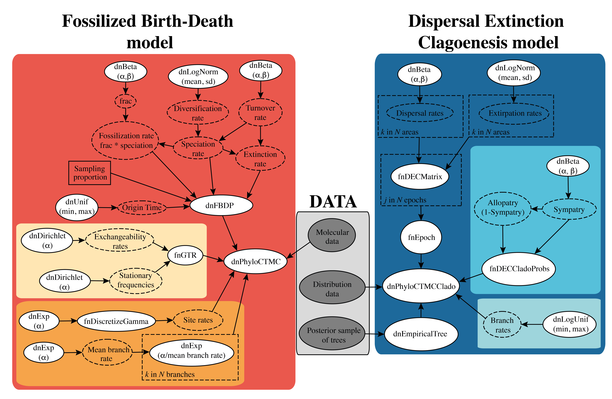

# revBayes scripts

The scripts run under revBayes v.1.1.1 (last checked November 2023). 

The **ARE** directory (*Ancestral Range Estimation*) contains the necessary scripts to perform the biogeographical analyses.  
- The biogeographical modelling is performed with the script **mcmc_A.Rev**.  
  - This script contains all the global settings needed for the analyses and is constructed in order to perform a full joint analysis (*i.e.*, FBD + DEC).  However, in the current implementation the FBD option is turned *off* and instead this script sources a file with a posterior sample of trees (generated from the code in the **FBD** directory); this is a stochastic 'tree' parameter used in the model. The script can also be run using a single fixed tree (substantially quicker).  
  - This script also contains the code for summarising the results of the modelling.  
- The FBD dating is performed with the scripts **model_FBDP_A.Rev**,  **model_UExp.Rev**, and **model_GTR.Rev**. This is similar to the scripts in the **FBD** directory, but were last tested in December 2021.  
- The DEC modelling is performed with the script **model_biogeo.Rev**.  
- The data needed to run the analyses are read with the script **model_DATA.Rev**.  

The **FBD** directory (*Fossilised Birth Death*) contains the necessary scripts to perform the FBD dating analyses.  
- The tree dating is performed with the script **mcmc_A.Rev**.
  - This script contains all the global settings needed and sources all other scripts (**model_DATA.Rev**, **model_FBDP_A.Rev**, **model_GTR.Rev**, and **model_UExp.Rev**).
- The results are summarised with the script **summarize.Rev**.  

The **data** directory contains all the necessary data and input files to run the analyses for the eight- and the three-area reconstructios. These data include:  
- Molecular alingment.  
- MCC trees and posterior sample of trees.
- Distribution data coded in *Nexus* format.
- Conectivity matrices (one for each epoch).
- Fossil ages.  
